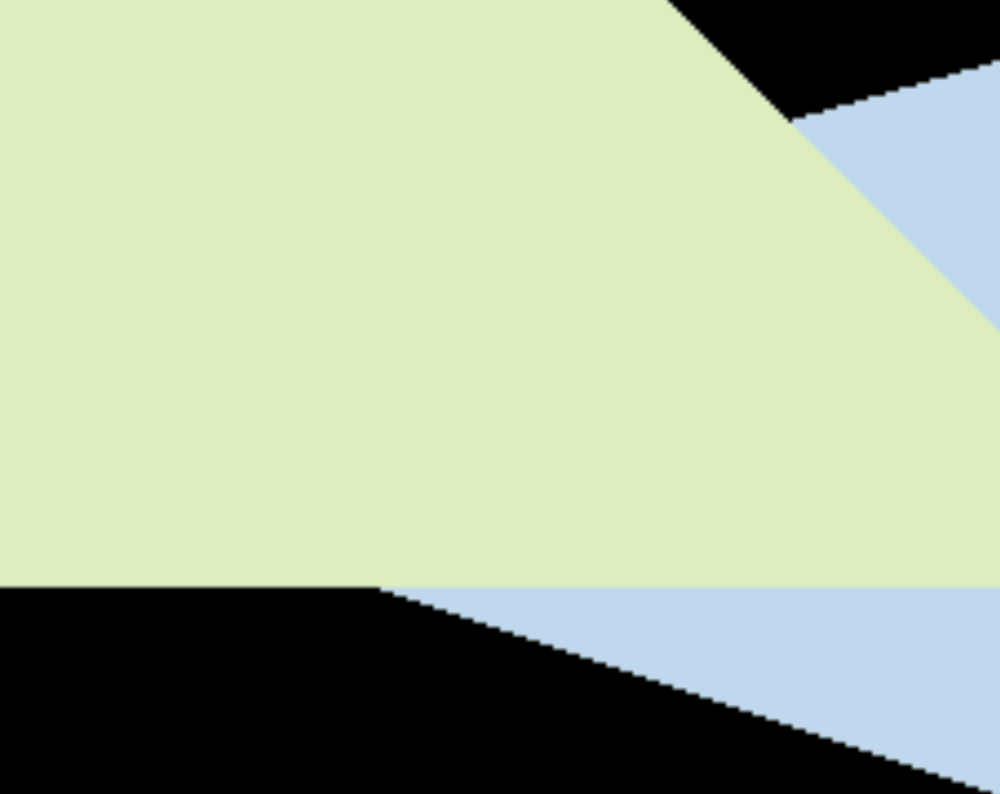
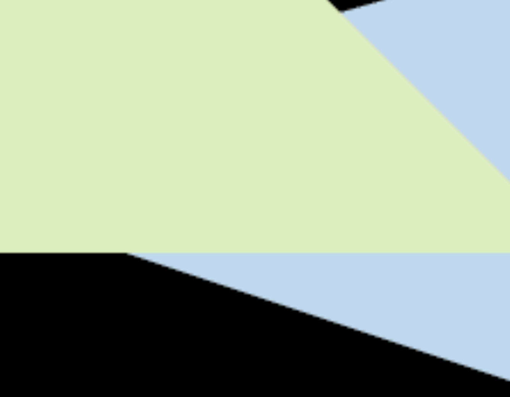

# Overview
When rendering a solid triangle on a digital display, it is necessary to rasterize the triangle into discrete pixels for display purposes. However, this process may introduce an unwanted effect known as aliasing, which can result in jagged edges and an overall lack of smoothness in the rendered image. This project first implemented rasterizer on two solid triangle with different position (implemented depth buffer) and then utilized a technique called Multi-Sample Anti-Aliasing (MSAA) to mitigate aliasing issues.

# Development environment
- build system generator: [CMake](https://cmake.org/)
- build system: [Ninja](https://ninja-build.org/)
- compiler: [GCC 12.2.0 aarch64-apple-darwin22](https://linux.die.net/man/1/gcc)
- Integrated Development Environment (IDE): [Visual Studio Code](https://code.visualstudio.com/) 
- C++ libraries:
  - C++ Standard Library
  - [Eigen3](https://eigen.tuxfamily.org/index.php?title=Main_Page)
  - [openCV2](https://opencv.org/)
- package manager: [vcpkg](https://github.com/Microsoft/vcpkg)
- version control system (VCS): [Git](https://git-scm.com/)

# Method
## rasterize triangle
I do it first to identify its bounding box. Subsequently, it is necessary to traverse every pixel within the bounding box and ascertain whether it lies inside the triangle ([sample](https://graphics32.github.io/Docs/Additional%20Topics/Sampling%20and%20Rasterization.htm)). If a pixel falls within the triangle, it is essential to determine whether its depth value can update the Z-buffer. The pixel should be colored only if the depth value can be updated. 
### Algorithm Outline

```c++
// Find out the bounding box of current triangle
int boundingBox_xLeft= MIN(triangle[0].x,triangle[1].x,triangle[2].x)
int boundingBox_xRight=MAX(triangle[0].x,triangle[1].x,triangle[2].x)
int boundingBox_yLeft=MIN(triangle[0].y,triangle[1].y,triangle[2].y)
int boundingBox_yRight=MAX(triangle[0].y,triangle[1].y,triangle[2].y)

//iterate through each pixel and find out if the current pixel is inside the triangle 
for each boundingBox_pixel i do
    if(insideTriangle())
        //interpolated depth value to calculate z value of that pixel
        z = interpolated()
        //compare z with depth buffer, if bigger, store it in depth buffer and color the pixel
        if(z>depth_buffer)
            depth_buffer=z
            setPixelColor()
end
```

### Inside triangle
To determine whether a point is inside a triangle, I used the cross product of the vectors formed by the three points of the triangle and the point being tested, with the edge vectors of the triangle. If the resulting signs of the cross products are all the same, then the point is inside the triangle. If there are different signs, then the point is outside the triangle.

### depth buffer
Here is Z-Buffer Algorithm:

```c++
for each triangle T 
  for each sample(x,y,z) in T
    if(z<zbuffer[x,y])           //closest sample so far 
      frameBuffer[x,y]=rgb;      //update color
      zbuffer[x,y]=z;            //update depth
    else      //nothing
```

### interpolate

## Multi-Sample Anti-Aliasing (MSAA)
### Aliasing Artifacts
[Aliasing Artifacts](https://education.siggraph.org/static/HyperGraph/aliasing/alias2a.htm#:~:text=The%20errors%20caused%20by%20aliasing,fine%20detail%2C%20and%20disintegrating%20textures.) caused by signals changing too fase (high frequency), but sampled too slowly
### MSAA
MSAA works by sampling each pixel multiple times, and then averaging the color values of the samples to produce a smoother image. MSAA computationally expensive than other anti-aliasing techniques, but it produces high-quality results with minimal performance impact.

# Result
Rendered two triangle without triangle

Compared after MSAA (before & after)
 

# Building

```
# Setup environment 

# Download repository
$ git clone git@github.com:Yuqian-He/rasterize-triangle.git
$ cd rasterize-triangle

# Configure and build project
$ mkdir build
$ cd build
$ cmake .. 
$ make

# Run the program
$ ./Rasterizer
```


